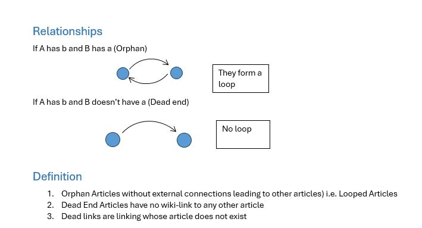
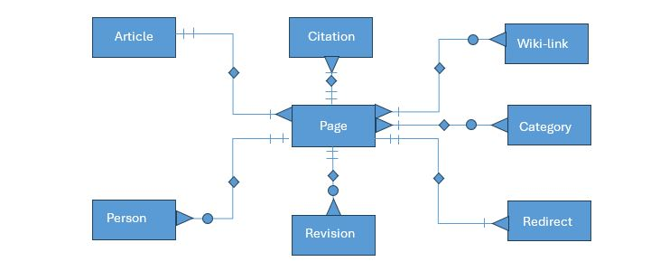

# Luganda-Wiki-Analysis-clean-data
Clean FIles (csv files) ready for data analysis based on 1st September 2026

# Luganda Wikimedia Community Uganda Analysis data capped 1 September 2026

## Table of Contents
- [Wikimedia Community Uganda](#wikimedia-community-uganda)
- [Article-Based Items to Track](#article-based-items-to-track)
- [Areas of Concern](#areas-of-concern)
- [Issues & Fixes](#issues--fixes)
  - [Definitions](#definitions)
  - [Relationships](#relationships)
  - [What Needs to Be Fixed](#what-needs-to-be-fixed)
- [Database Schema & Main Entities](#database-schema--main-entities)
- [Wikipedia Race](#wikipedia-race)
- [Challenges So Far](#challenges-so-far)
- [Possible Graphs](#possible-graphs)
- [References & Research Links](#references--research-links)

---

## Wikimedia Community Uganda

Online communities are organized around articles that connect in two primary ways:
* **Shared Categories:** Articles sharing one or more categories ($\ge 1$).
* **Inter-wiki Linking:** Articles referencing each other via internal links.

---

## Article-Based Items to Track

1. Number of users
2. Most edited articles / Number of revisions
3. Least edited articles / Number of revisions
4. Newcomers
5. Active editors (Contributors)
6. Article views
7. Medium used to view articles
8. Time of editing (Morning, Afternoon, Evening, or Night)
9. Number of redirects *(Query to determine)*
10. Number of links on page *(Query to determine)*
11. Orphaned pages *(Query to determine)*
12. Dead-end articles *(Query to determine)*

---

## Areas of Concern

1. Luganda Wikipedia

[Click here to view image](img/patterns.JPG)

---

## Issues & Fixes

### Definitions
1. **Orphan Articles:** Articles without incoming connections from other articles (including looped articles).
2. **Dead-end Articles:** Articles that contain no internal wiki-links leading to any other article.
3. **Dead Links:** Hyperlinks whose target article does not exist.

### Relationships
* **Orphan Relationship:** If $A$ links to $B$, but $B$ does not link back to $A$ (and no other page links to $A$).
* **Dead-end Relationship:** If $A$ links to $B$, but $B$ has no outgoing links to any other page.

### What Needs to Be Fixed
1. Dead-end articles
2. Dead links
3. Orphaned articles
4. High Priority: Dead-end orphaned articles

---

## Database Schema & Main Entities

### Entities
* `Page`
* `Article`
* `Revision`
* `Citation`
* `Wiki-link`
* `Categories`
* `Country`
* `Redirect`
* `Person`

---

### Entity Attributes

#### Page
* `Id`
* `Page Title`
* `NS` (Namespace)
* `Wiki-link-ID`
* `Citation-ID`
* `Headings` (Number of sections in article)
* `Paragraphs` (Number of paragraphs)
* `Category-ID`
* `Number of Images` ($\ge 1$)
* `Date of Creation`

#### Article
* `Page-ID`
* `Title`
* `Body`

#### Revision
* `Page-ID`
* `Revision-ID`
* `Timestamp`
* `Username`
* `Comment`
* `Origin`
* `Bytes`
* `Sha1`

#### Citation
* `Id`
* `Citation`
* `Page-ID`

#### Wiki-links
* `Id`
* `Link`
* `Page-ID`

#### Categories
* `Id`
* `Category`
* `Page-ID`

#### Country
* `Id`
* `Country`
* `Person-ID`

#### Redirect
* `Id`
* `Redirect`
* `Page-ID`

#### Person
* `Id`
* `Gender`
* `Sexual orientation`
* `Date of Birth (Dob)`
* `Date of Death (Dod)`
* `Place of birth`
* `Country of origin`
* `Citizenship`
* `Page-ID`

---

## Wikipedia Race

**Concept:** Which paths of internal wiki-links allow you to navigate from a starting article to a destination article without directly searching the article name?

> *Did you know about the six degrees of separation on Wikipedia?*

### Suggested Games & Exploration
* The longest path between articles on Wikipedia.
* The shortest path between articles on Wikipedia.

---

## Challenges So Far

1. Tracking added bytes accurately
2. Tracking deleted bytes accurately
3. Identifying the district of contributors
4. Accurately attributing page views
5. Measuring article quality

---

## Possible Graphs

1. Title vs. Revisions
2. Day vs. Time
3. Username vs. Bytes
4. Day vs. Bytes
5. Time vs. Bytes

---

## References & Research Links

* [Research: Knowledge Gaps Index / Measurement / Content](https://meta.wikimedia.org/wiki/Research:Knowledge_Gaps_Index/Measurement/Content)
* [Research: Page view](https://meta.wikimedia.org/wiki/Research:Page_view)
* [List of articles every Wikipedia should have](https://meta.wikimedia.org/wiki/List_of_articles_every_Wikipedia_should_have)
